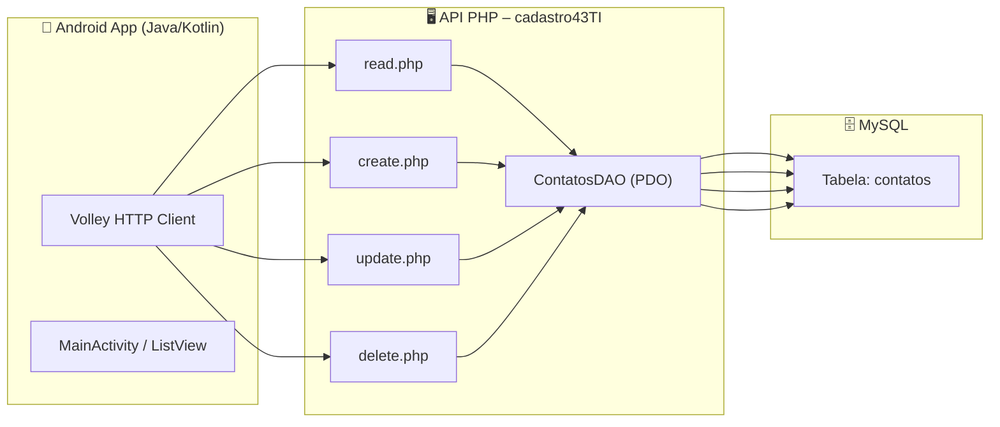
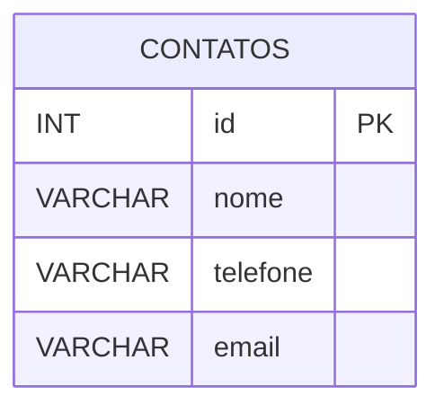
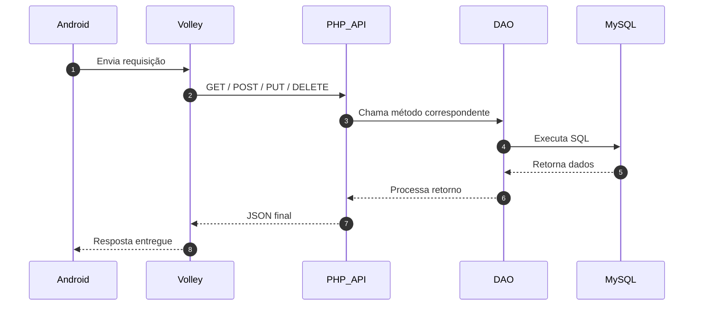

# 🗄️ API Cadastro43TI – PHP + MySQL


Este repositório contém a API **Cadastro43TI**, desenvolvida em PHP com PDO e MySQL, utilizada como backend do aplicativo Android **TestarAPI**:

📱 https://github.com/ricardaoquadros-jpg/testarAPI

O projeto foi criado no **Visual Code**, refinado com **ChatGPT 5.1**, e finalizado na **IDE Antigravity** com melhorias sugeridas pelo **Gemini 3 Pro**.

---

## 🎯 Objetivo da API

- 🔎 Buscar contatos  
- 📋 Listar registros  
- ➕ Criar novos contatos  
- ✏️ Atualizar informações  
- 🗑 Remover registros  
- 🔄 Respostas sempre em JSON  

---

## 🚀 Endpoints da API

### 📥 GET – Buscar contatos por nome

/view/read.php?nome=ricardo

Campos:
- nome  
- telefone  
- email  

### ✏️ PUT – Atualizar contato

/view/update.php

JSON esperado:
```json
{
  "id": "1",
  "nome": "Novo Nome",
  "telefone": "999999",
  "email": "email@exemplo.com"
}
```
###🗑 DELETE – Remover contato

/view/delete.php?id=1

## 📁 Estrutura do Projeto

```bash
/cadastro43TI
├─ model/
│  ├─ Contatos.class.php
│  ├─ conexao.class.php
├─ controller/
│  ├─ ContatosDAO.class.php
├─ view/
│  ├─ read.php
│  ├─ create.php
│  ├─ update.php
│  ├─ delete.php
│  ├─ form.html
│  └─ teste.php
└─ README.md
```
## 🧩 Arquitetura do Sistema



## 🧑‍💻 Autor

**Ricardo Quadros**  
- Estudante de Engenharia da Computação na UERGS  
- Técnico em Informática na Dr. Solon Tavares 
- Estagiário de Tecnologia e Informação – Prefeitura de Guaíba  
- Guaíba, RS – Brasil

---

## 📫 Contato

- GitHub: https://github.com/ricardaoquadros-jpg  
- Email: ricardaoquadros@gmail.com
- Linkedin: https://www.linkedin.com/in/ricardopquadros/


